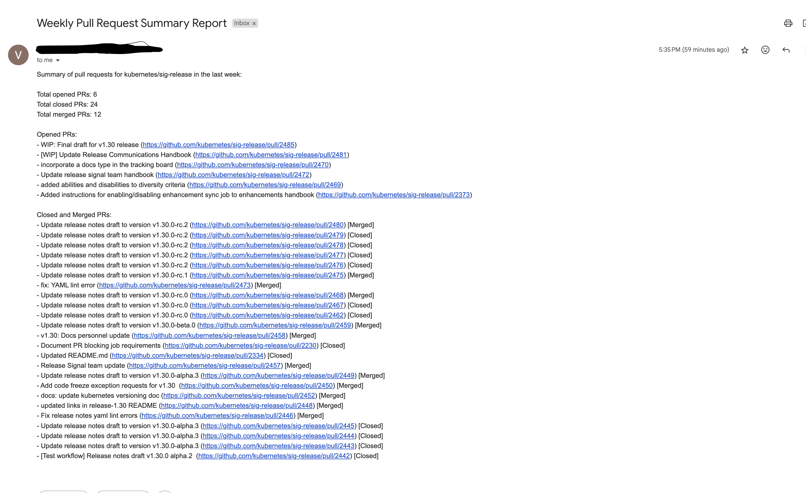

### How to use this application

- You can build the image from the docker file.
- When you docker run the application or use kubernetes to deploy the application, you need to set the below environment variables:
```
FROM_EMAIL
SMTP_SERVER
SMTP_PORT
SMTP_USERNAME
SMTP_PASSWORD
```
- Below is the sample docker comamnd to run the application
```
docker build -t pull-request-summary .
docker run -d -p 5000:5000 -e FROM_EMAIL= -e SMTP_SERVER=smtp.googlemail.com -e SMTP_PORT= -e SMTP_USERNAME= -e SMTP_PASSWORD="" pull-request-summary
```
- Now the application will be running and you can send query to the application to send the report to you.

```
curl -X POST \
  http://localhost:5000/send-email \
  -H 'Content-Type: application/json' \
  -d '{
    "repo_name": "kubernetes/sig-release",
    "to_email": "venkatsudharsanam.m@gmail.com"
}'
```

- Here is the sample email i got from the application : 
